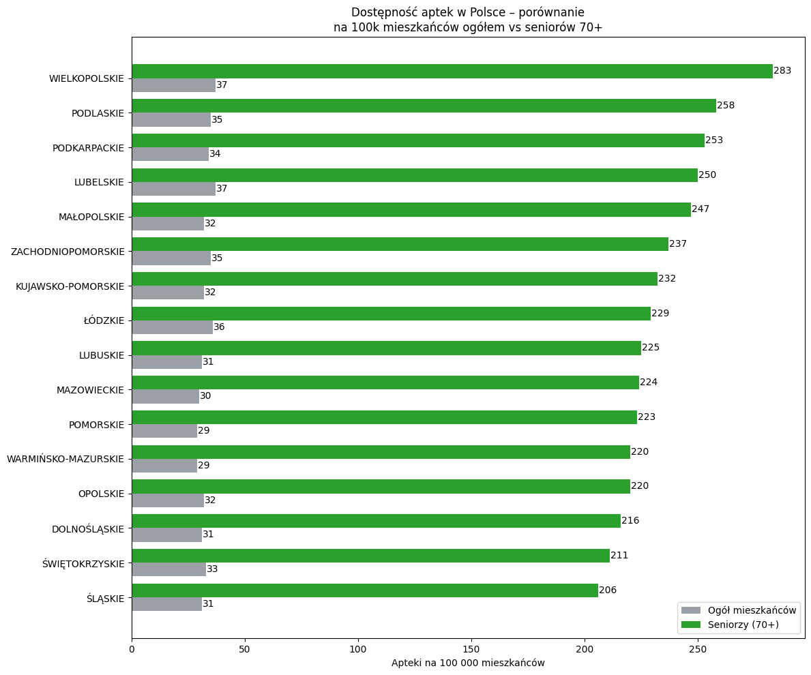
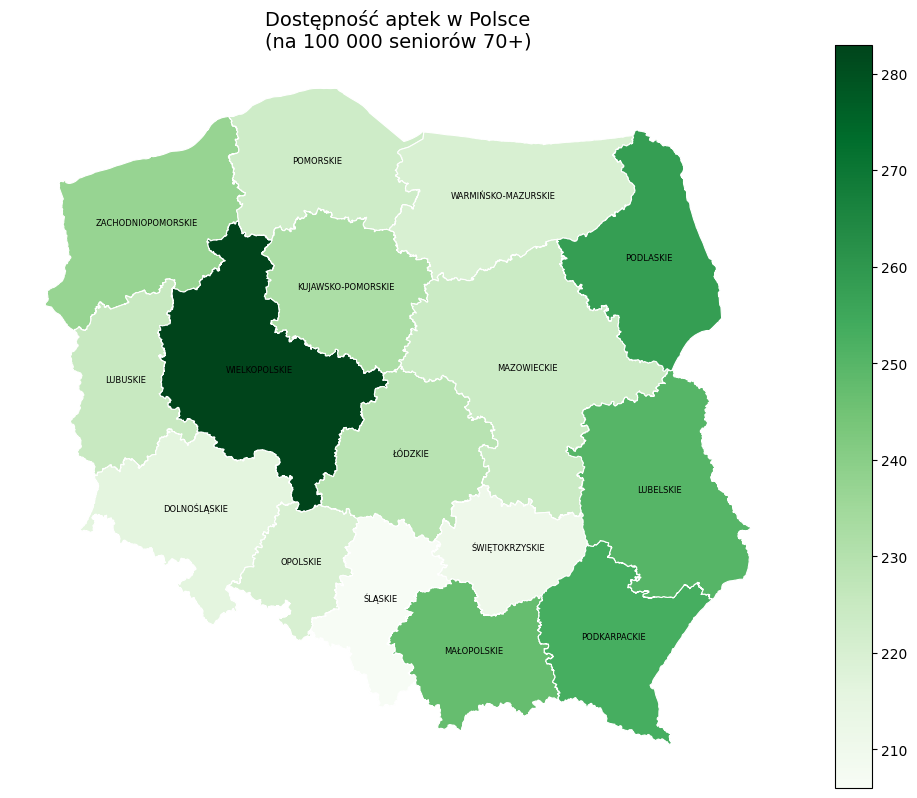
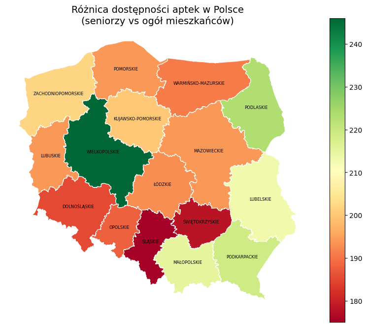

# Dostępność Aptek w Polsce

Projekt analityczny badający dostępność aptek w Polsce na poziomie województw z perspektywy całej populacji oraz mieszkańców w wieku 70+.

Celem analizy było sprawdzenie, czy rozmieszczenie infrastruktury farmaceutycznej odpowiada potrzebom demograficznym, szczególnie w regionach z większą liczbą seniorów.

Analiza porównuje dwa wskaźniki:

- liczbę aptek na 100 000 mieszkańców ogółem,
- liczbę aptek na 100 000 mieszkańców w wieku 70+.

Pytania badawcze:

- Czy województwa różnią się pod względem dostępności aptek?
- Czy ranking regionów zmienia się po przejściu z populacji ogółem na populację 70+?
- Czy rozmieszczenie aptek wygląda na dopasowane do struktury wieku mieszkańców?

## Dane

W projekcie wykorzystano trzy lokalne źródła danych z katalogu `data/`:

- `Rejestr_Aptek_stan_na_dzien_2026-04-21.csv` - rejestr aptek,
- `LUDN_2137_CTAB_20260414235116.csv` - dane o liczbie ludności ogółem i populacji 70+,
- `wojewodztwa/` - pliki geoprzestrzenne z granicami województw do map.

## Metodologia

Analiza została wykonana w notebooku [EDA.ipynb](EDA.ipynb). Główne kroki:

1. Wczytanie rejestru aptek i wybór kluczowych kolumn.
2. Odfiltrowanie placówek aktywnych.
3. Ograniczenie danych do aptek ogólnodostępnych i punktów aptecznych.
4. Ujednolicenie nazw województw.
5. Agregacja liczby aptek do poziomu województw.
6. Połączenie danych o aptekach z danymi demograficznymi.
7. Wyliczenie wskaźników na 100 000 mieszkańców.
8. Przygotowanie wykresu porównawczego i map województw.

Wskaźniki:

- `apteki_na_100k` - liczba aptek na 100 000 mieszkańców,
- `apteki_na_100k_70plus` - liczba aptek na 100 000 mieszkańców w wieku 70+,
- `roznica` - różnica między dostępnością dla seniorów i dla populacji ogółem.

## Najważniejsze Wnioski

- dostępność aptek liczona względem całej populacji jest między województwami dość zbliżona,
- po przeliczeniu wskaźnika na grupę 70+ rozpiętość wyników wyraźnie rośnie,
- sugeruje to, że rozmieszczenie aptek jest bardziej dopasowane do liczby mieszkańców niż do struktury wieku,
- najwyższy wskaźnik dla populacji 70+ odnotowano w województwie `WIELKOPOLSKIM` - `283` apteki na 100 tys. mieszkańców 70+,
- najniższy wskaźnik dla populacji 70+ odnotowano w województwie `ŚLĄSKIM` - `206` aptek na 100 tys. mieszkańców 70+.

Przykładowe rankingi z notebooka:

- najwyższe `apteki_na_100k`: `LUBELSKIE`, `WIELKOPOLSKIE`, `ŁÓDZKIE`,
- najwyższe `apteki_na_100k_70plus`: `WIELKOPOLSKIE`, `PODLASKIE`, `PODKARPACKIE`,
- najniższe `apteki_na_100k_70plus`: `ŚLĄSKIE`, `ŚWIĘTOKRZYSKIE`, `DOLNOŚLĄSKIE`.

## Wizualizacje

### Porównanie wskaźników



### Mapa dostępności dla seniorów 70+



### Mapa różnicy dostępności



## Technologie

Projekt został przygotowany w Pythonie z użyciem:

- `pandas`
- `geopandas`
- `matplotlib`
- `seaborn`
- `adjustText`
- `jupyterlab`

Konfiguracja środowiska znajduje się w [pyproject.toml](pyproject.toml), a pełna blokada zależności w `uv.lock`.

## Struktura Repozytorium

```text
pharmacy-accessibility-poland/
|-- assets/
|   `-- readme/
|       |-- wykres-porownanie-dostepnosci.png
|       |-- mapa-seniorzy-70plus.png
|       |-- mapa-ogol-mieszkancow.png
|       `-- mapa-roznica-dostepnosci.png
|-- data/
|   |-- Rejestr_Aptek_stan_na_dzien_2026-04-21.csv
|   |-- LUDN_2137_CTAB_20260414235116.csv
|   `-- wojewodztwa/
|-- EDA.ipynb
|-- pyproject.toml
|-- uv.lock
`-- README.md
```

## Jak Uruchomić Projekt

Wymagania:

- Python `3.13+`
- `uv` lub `pip`

Dane wejściowe są już dostępne w katalogu `data/`.

### Wariant z `uv`

```bash
uv sync
uv run jupyter lab
```

### Wariant z `pip`

```bash
python -m venv .venv
.venv\Scripts\activate
pip install -e .
jupyter lab
```

Po uruchomieniu otwórz notebook `EDA.ipynb`.
